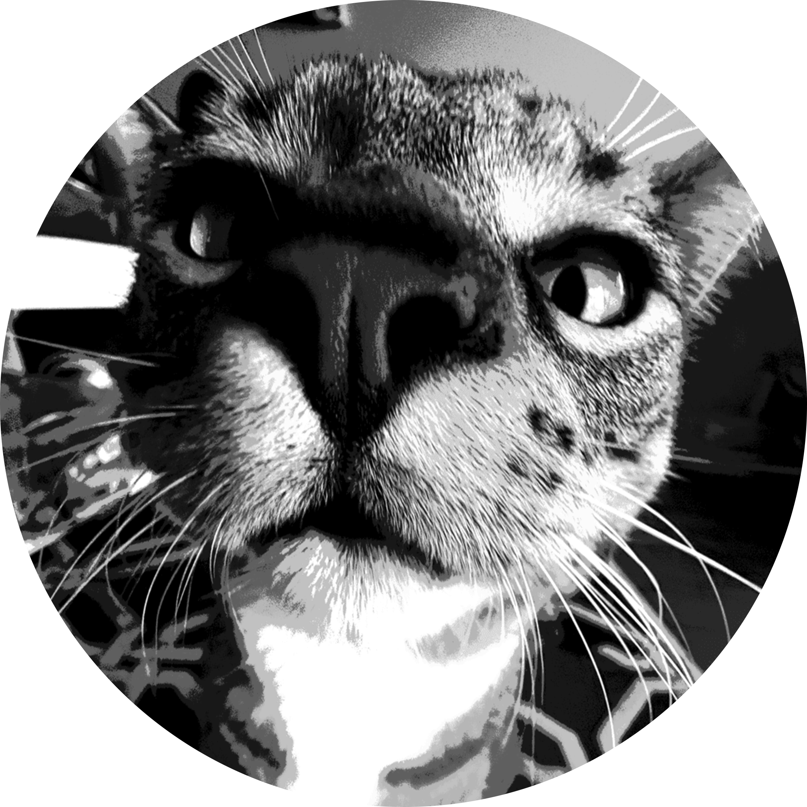
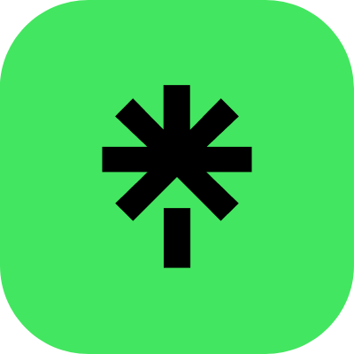
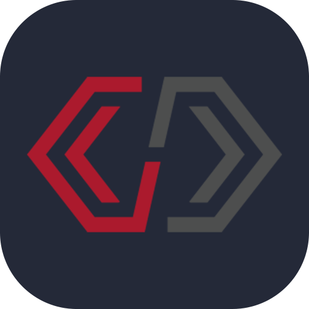

<h3>
  
  
  Hey!
</h3>

---

🔥・I'm <b>mydimons</b>.

🎮・Game dev, robotics nerd, and overall programming enthusiast

<!-- 🤖・Programming head for FRC team 7287 -->

🧪・I love to experiment with code and try new things!

🤔・Thinking about pursuing <b>Electrical Engineering</b>

🐈・Cat lover :)

 

  
  
  
  
  
  
  

---

<h3 align="center">
  <i>« “A jack of all trades is a master of none, but often times better than a master of one.” »</i>
</h3>

  <i>- some person, long ago</i>

🛠️ Skills

<h1>🔥 Languages</h1>

  

  

 

<h1>⚙️ Programs</h1>

  

  

  

  

 

  

  

  

<h1>📖 Learning</h1>

  

  

  

 

<h1>🤔 Interested In</h1>

  

  

  

  

  

  

 
 

📊 Stats

  

 
 

 
 

 
 

<!--
README Inspiration:
  - https://github.com/Coordinate-Cat/Coordinate-Cat
  - https://github.com/vbriand/vbriand
  - https://github.com/hussainweb/hussainweb
  - https://github.com/Aveek-Saha/Aveek-Saha
  - https://github.com/orhun/orhun

Tools used:
  - https://github.com/tandpfun/skill-icons
  - https://badges.pufler.dev
  - https://github-readme-activity-graph.vercel.app

TODO:
  - Add icons for:
    - Audacity

cool secret comment
-->
